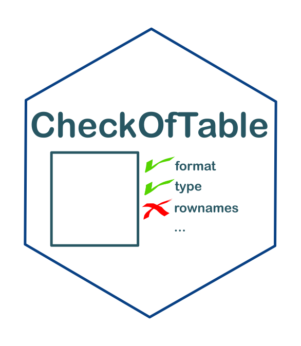

<!-- README.md is generated from README.Rmd. Please edit that file -->

```{r setup, include = FALSE}
knitr::opts_chunk$set(
  collapse = TRUE,
  comment = "#>",
  fig.path = "man/figures/README-",
  out.width = "100%"
)
```
```{r packages, message = FALSE, warning=FALSE, echo = FALSE}
# Chargement des packages
library(tidyverse)
library(here)
library(gt)
```


# Check of table 

<!-- badges: start -->
[](https://www.tidyverse.org/lifecycle/#maturing)
[](commits/master)
[](https://www.gnu.org/licenses/gpl-3.0.en.html)
<!-- [](https://github.com/SebastienBoutry/IBDL/actions) -->
<!-- badges: end -->


# Installation de `{CheckOfTable}`

La version du package `{CheckOfTable}` peut se télécharger via le site Github pour cela on aura besoin du package `{remotes}`:

```{r install, eval=FALSE}
remotes::install_github("SebastienBoutry/CheckOfTable")
```

_NB : Le logiciel RTools est parfois nécessaire sur les machines Windows pour pouvoir installer le package `{remotes}`, puisque l'installation ici se fait depuis un dépôt de développement (Github) et non un dépôt officiel R. Vous pouvez l'installer ici : [Rtools](https://cran.r-project.org/bin/windows/Rtools/)_

Une fois installé, vous pouvez charger le package avec :

```{r echo=TRUE}
library(CheckOfTable)
```

# Objectif

L'objectif de ce package `{CheckOfTable}` est de fournir les fonctions nécessaires pour contrôler les tables.

# Utilisation

Ce package sert au contrôle du format d'un jeu de données. Il renvoie les messages d'erreurs afin de corriger sur le jeu de données.

## Les étapes

 Il est recommandé d'enchaîner les fonctions du package `{CheckOfTable}` pour valider le fichier d'importation.

# Contact

<div align="center">

&nbsp;&nbsp;&nbsp;:e-mail: [Email][Email]&nbsp;&nbsp;&nbsp;|&nbsp;&nbsp;&nbsp;:speech_balloon: [Twitter][Twitter]&nbsp;&nbsp;&nbsp;|&nbsp;&nbsp;&nbsp;:necktie: [LinkedIn][LinkedIn]

<!--
Quick Link
-->
[Twitter]:https://twitter.com/SebBoutry
[LinkedIn]:https://www.linkedin.com/in/s%C3%A9bastien-boutry-4a77ba10/
[Email]:mailto:sebastien.boutry@inrae.fr


</div>

# Références


