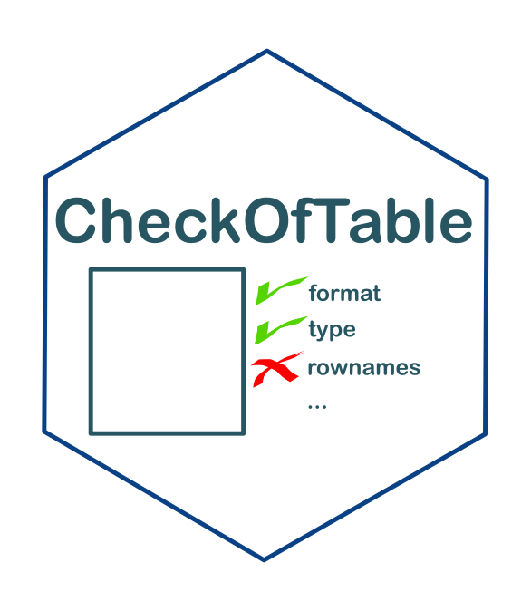

<!-- README.md is generated from README.Rmd. Please edit that file -->

# Check of table 

<!-- badges: start -->

[](https://www.tidyverse.org/lifecycle/#maturing)
[](commits/master)
[](https://www.gnu.org/licenses/gpl-3.0.en.html)
<!-- [](https://github.com/SebastienBoutry/IBDL/actions) -->
<!-- badges: end -->

# Installation de `{CheckOfTable}`

La version du package `{CheckOfTable}` peut se télécharger via le site
Github pour cela on aura besoin du package `{remotes}`:

``` r
remotes::install_github("SebastienBoutry/CheckOfTable")
```

*NB : Le logiciel RTools est parfois nécessaire sur les machines Windows
pour pouvoir installer le package `{remotes}`, puisque l’installation
ici se fait depuis un dépôt de développement (Github) et non un dépôt
officiel R. Vous pouvez l’installer ici :
[Rtools](https://cran.r-project.org/bin/windows/Rtools/)*

Une fois installé, vous pouvez charger le package avec :

``` r
library(CheckOfTable)
```

# Objectif

L’objectif de ce package `{CheckOfTable}` est de fournir les fonctions
nécessaires pour contrôler les tables.

# Utilisation

## Les besoins

## Les étapes

# Contact

<div align="center">

   :e-mail:
[Email](mailto:sebastien.boutry@inrae.fr)   \|   :speech\_balloon:
[Twitter](https://twitter.com/SebBoutry)   \|   :necktie:
[LinkedIn](https://www.linkedin.com/in/s%C3%A9bastien-boutry-4a77ba10/)

<!--
Quick Link
-->

</div>

# Références
